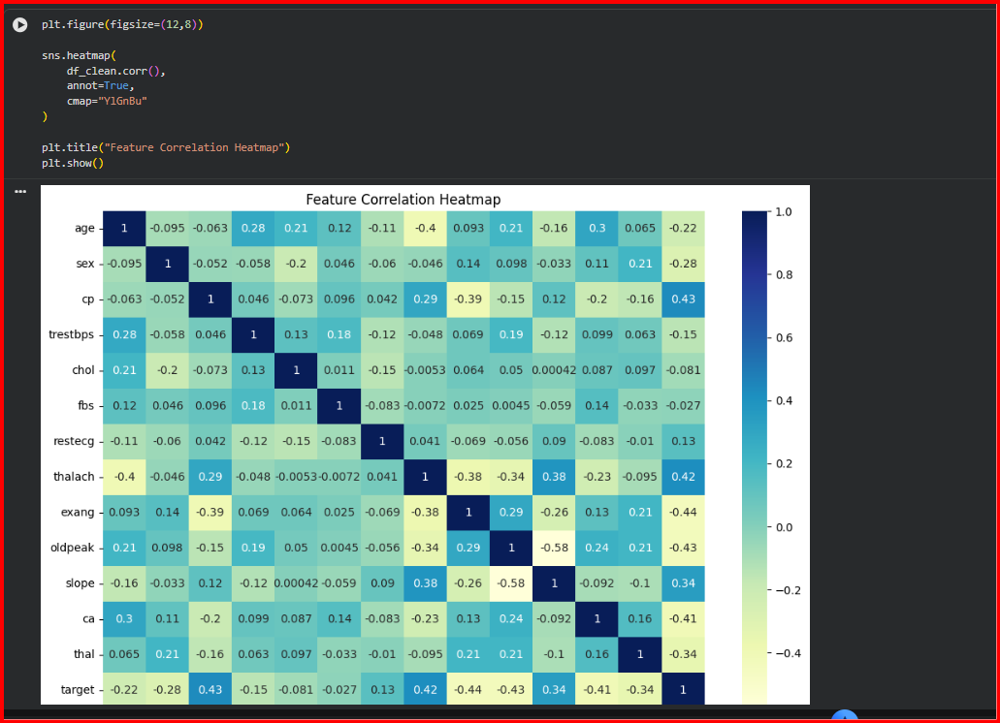
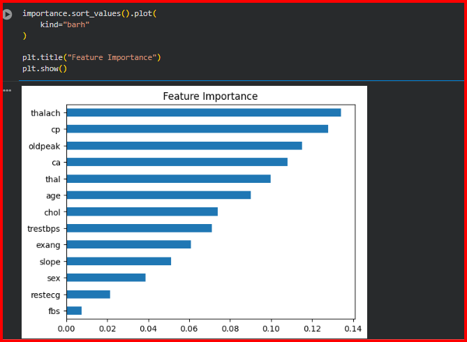
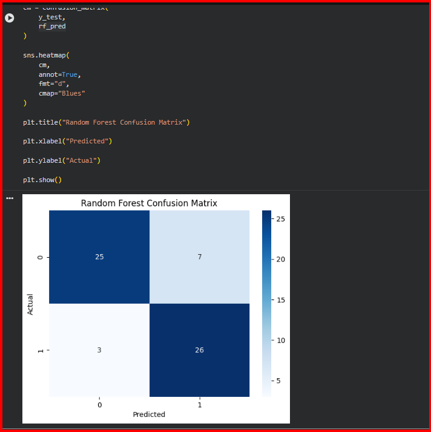

# ❤️ Heart Disease Prediction Using Machine Learning

### Predicting Heart Disease Risk Through Data Driven Classification Models

This project develops and evaluates multiple machine learning models to predict the likelihood of heart disease using patient health information. The objective is to compare different classification algorithms, understand the factors influencing predictions, and identify the most effective model for disease detection.

---

## Project Overview

Heart disease remains one of the leading causes of mortality worldwide. Early identification of high risk patients can significantly improve treatment outcomes and preventive care strategies.

In this project, a machine learning pipeline was built using real world healthcare data to predict whether a patient is likely to have heart disease based on medical attributes such as age, cholesterol level, blood pressure, chest pain type, and heart rate measurements.

The workflow covers data preprocessing, feature engineering, model training, evaluation, and interpretation of results.

---

## Problem Statement

The goal is to build a supervised machine learning classification system capable of predicting the presence of heart disease using patient health records.

The project focuses on:

* Understanding the dataset
* Preparing data for machine learning
* Identifying important predictive features
* Training multiple classification models
* Comparing model performance using evaluation metrics
* Selecting and analyzing the best performing model

---

## Dataset Information

**Dataset:** Heart Disease Prediction Dataset

**Source:** Kaggle

The dataset contains patient health records with multiple clinical attributes commonly used in cardiovascular assessment.

### Features Include

* Age
* Sex
* Chest Pain Type
* Resting Blood Pressure
* Cholesterol Level
* Fasting Blood Sugar
* Resting ECG Results
* Maximum Heart Rate Achieved
* Exercise Induced Angina
* ST Depression
* Slope
* Number of Major Vessels
* Thalassemia

### Target Variable

* `target = 1` → Presence of Heart Disease
* `target = 0` → No Heart Disease

---

## Project Workflow

### 1. Data Exploration

The dataset was inspected to understand its structure, identify missing values, verify data types, and assess overall data quality.

### 2. Data Preprocessing

Data preprocessing steps included:

* Missing value verification
* Duplicate record removal
* Feature and target separation
* Train test split using an 80:20 ratio
* Feature scaling using StandardScaler

### 3. Feature Engineering

Feature relevance was analyzed using:

* Correlation Analysis
* Feature Importance Analysis

This helped identify the variables contributing most to heart disease prediction.

### 4. Model Development

Three machine learning algorithms were trained and evaluated:

| Model               | Type                          |
| ------------------- | ----------------------------- |
| Logistic Regression | Linear Classification         |
| K Nearest Neighbors | Distance Based Classification |
| Random Forest       | Ensemble Learning             |

### 5. Model Evaluation

Models were compared using:

* Accuracy
* Precision
* Recall
* F1 Score

The best model was further analyzed using a confusion matrix.

---

## Technologies Used

| Category                | Tools               |
| ----------------------- | ------------------- |
| Programming Language    | Python              |
| Data Analysis           | Pandas, NumPy       |
| Data Visualization      | Matplotlib, Seaborn |
| Machine Learning        | Scikit Learn        |
| Development Environment | Google Colab        |
| Version Control         | Git and GitHub      |

---

## Repository Structure

```text
heart-disease-prediction-ml

│
├── dataset
│   └── heart.csv
│
├── notebook
│   └── Heart_Disease_Prediction.ipynb
│
├── images
│   ├── correlation_heatmap.png
│   ├── feature_importance.png
│   ├── confusion_matrix.png
│   └── model_comparison.png
│
├── README.md
└── LICENSE
```

---

## Key Insights

### Feature Importance

Several clinical variables demonstrated stronger predictive influence than others, highlighting their significance in cardiovascular risk assessment.

### Model Performance

All three algorithms successfully learned patterns within the dataset, but performance varied based on their underlying learning approaches.

### Classification Effectiveness

Ensemble methods showed improved predictive capability by capturing complex relationships between medical attributes.

---

## Results Summary

The trained models were evaluated on unseen test data and compared using standard classification metrics.

| Model               | Accuracy        | Precision | Recall | F1 Score |
| ------------------- | --------------- | --------- | ------ | -------- |
| Logistic Regression | Notebook Output |           |        |          |
| K Nearest Neighbors | Notebook Output |           |        |          |
| Random Forest       | Notebook Output |           |        |          |

*Replace with actual results from notebook.*

---

## Best Model Analysis

The best performing model was selected based on overall evaluation metrics.

A confusion matrix was used to examine:

* True Positives
* True Negatives
* False Positives
* False Negatives

This analysis provided deeper insight into prediction quality and classification reliability.

---

## Visualizations

The project includes:

* Correlation Heatmap
* Feature Importance Plot
* Model Accuracy Comparison Chart
* Confusion Matrix

### Sample Outputs

```markdown





```

---

## Conclusion

This project successfully developed and compared three machine learning models for heart disease prediction. Through preprocessing, feature analysis, model training, and evaluation, meaningful insights were extracted from healthcare data. Among the evaluated algorithms, the best performing model demonstrated strong predictive capability and reliable classification performance. The findings highlight the potential of machine learning as a decision support tool for early disease detection and risk assessment.

---

## Future Improvements

Potential extensions of this project include:

* Hyperparameter Optimization
* Cross Validation Analysis
* Ensemble Model Stacking
* Explainable AI Techniques
* Web Based Prediction Interface
* Integration with Healthcare Dashboards

---

## Author

**Mohit Assudani**

Final Year Engineering Student

Machine Learning and Data Analytics Enthusiast

GitHub: https://github.com/rotric04
